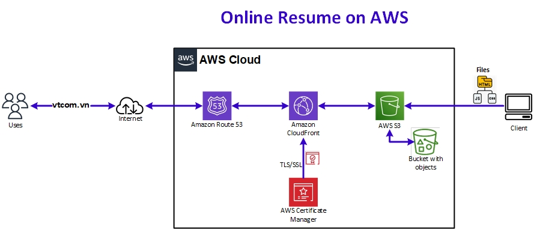

# CNE430-FinalProject: Online Resume on AWS
## Project Overview
### Build and host an online resume on a secure web server using a range of AWS services: [S3](https://aws.amazon.com/s3/), [Route 53](https://aws.amazon.com/route53/), [CloudFront](https://aws.amazon.com/cloudfront/), and [AWS Certificate Manager](https://aws.amazon.com/certificate-manager/) to provide scalability, security, and reliability.

## Build a S3 Static Website
* Create HTNL, CSS and JavaScript files for:
	- Main page
	- John Doe's Resume Page
	- Alex Johnson's Resume Page
	- Ryan Miller's Resume Page
* Create a S3 Bucket and upload fies to this bucket.
* Configure S3 to host a static website with public access.

